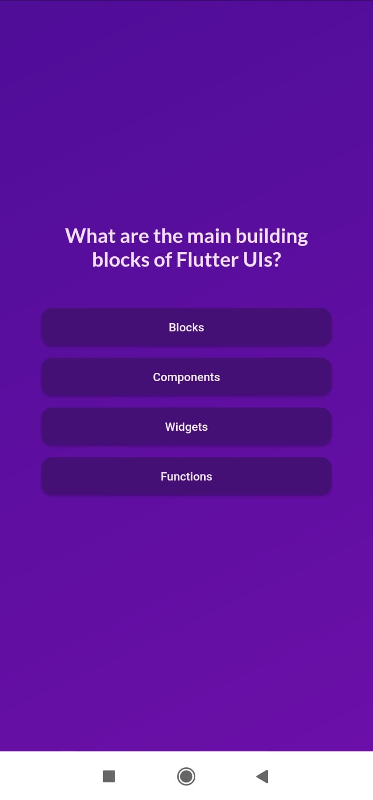
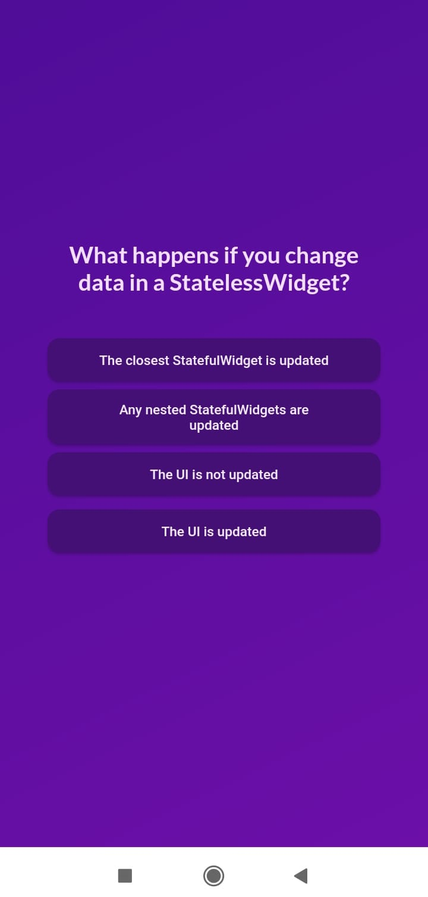
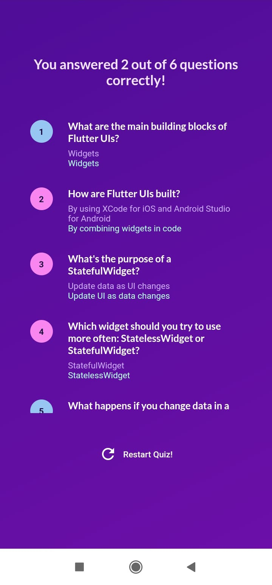

# Quiz Flutter App

A simple and interactive quiz app designed to test your knowledge on Flutter.

## Features

- Multiple-choice questions on flutter.
- Real-time score tracking.
- User-friendly interface with interactive elements.
- Randomized questions to ensure a varied experience.
- Restart quiz option

## Screenshots

<p >
    
    
  
  
</p>


## Getting Started

### Prerequisites

- Flutter SDK: [Install Flutter](https://flutter.dev/docs/get-started/install)
- Dart SDK (included with Flutter)

### Installation

1. Clone the repository:
    ```sh
    git clone https://github.com/aparnaprabhuu/Quiz-App.git
    ```
2. Navigate to the project directory:
    ```sh
    cd Quiz-App
    ```
3. Install dependencies:
    ```sh
    flutter pub get
    ```

### Running the App

1. Ensure a device is connected or an emulator is running.
2. Run the app:
    ```sh
    flutter run
    ```
